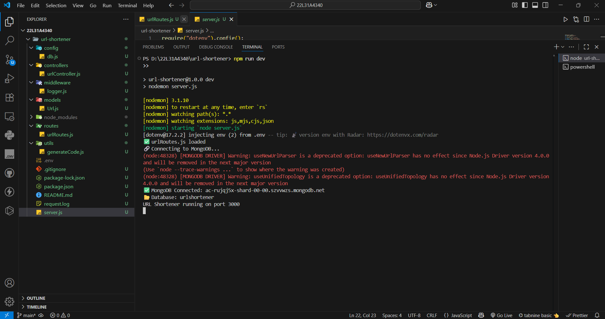
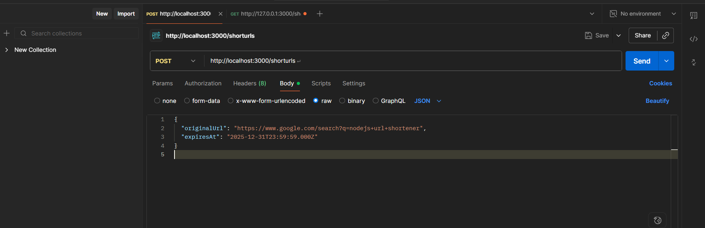

# URL Shortener

## Design

- **server.js**: Entry point, sets up Express, middleware, routes, and MongoDB connection.
- **config/db.js**: MongoDB connection logic.
- **middleware/logger.js**: Logs every request (method + URL).
- **models/Url.js**: Mongoose schema for URLs (original, shortcode, expiry).
- **routes/urlRoutes.js**: API endpoints for shortening, redirecting, and info.
- **controllers/urlController.js**: Business logic for URL creation, redirection, and info.
- **utils/generateCode.js**: Generates unique shortcodes.

## Setup Instructions

1. Install dependencies:
   ```sh
   npm install express mongoose dotenv
   ```
2. Set up a `.env` file with:
   ```env
   MONGO_URI=mongodb://localhost:27017/urlshortener
   PORT=3000
   ```
3. Start the server:
   ```sh
   node server.js
   ```

## API Endpoints

- `POST /api/shorten` - Shorten a URL
- `GET /api/:code` - Redirect to original URL
- `GET /api/info/:code` - Get info about a shortened URL




